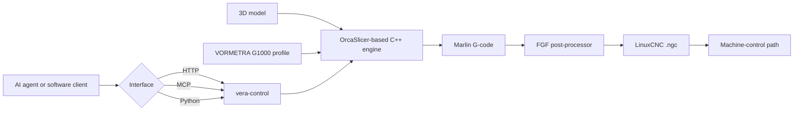

# VORMETRA Slice

[](https://github.com/mehmeterendereli/vormetra-slice/actions/workflows/vera-control.yml)

**Open slicing and programmatic-control workspace for the VORMETRA G1000 large-format pellet/FGF manufacturing system.**

VORMETRA Slice combines an OrcaSlicer-based C++ engine, a documented **1000 × 1000 × 1000 mm** G1000 machine profile and a Python control bridge that exposes the slicer through HTTP, MCP and direct imports.

**Current status:** active engineering · public source · automated Python control/profile verification · real CLI/profile validation · physical G1000 commissioning is **not** claimed by this repository

[Open-source portfolio](https://www.mehmeterendereli.com/en/open-source) · [G1000 profile evidence](resources/profiles/VORMETRA/README.md) · [vera-control documentation](vera-control/README.md) · [Upstream OrcaSlicer credits](README.upstream.md)

> The purpose of this repository is not to make the machine look finished. It is to make the software chain, assumptions, interfaces and remaining calibration work inspectable.

## What has been demonstrated

| Evidence | Current repository proof |
|---|---|
| **Machine profile** | A VORMETRA G1000 vendor profile with a 1000 × 1000 × 1000 mm printable envelope and 5.0 mm nozzle configuration |
| **Real slicing path** | A 200 × 200 × 100 mm test cube was sliced through the official OrcaSlicer v2.4.2 CLI; the current regression path checks for Marlin G-code rather than silent Klipper macros |
| **Controller conversion** | Generated G-code was passed through the FGF post-processing path and converted into LinuxCNC `.ngc` output with coordinated U-axis extrusion and fail-closed motion checks |
| **Programmatic control** | `/health`, `/profiles`, `/validate` and `/slice` HTTP endpoints; native MCP tools; direct Python API; and a lightweight Vera Console |
| **Automated verification** | Linux and Windows CI run package compilation plus the control, API, profile-safety and STL test suite on Python 3.10 and 3.13 |
| **Runtime protection** | Heavy jobs are guarded by a single-process lock and lock file; competing HTTP work receives a clear `409` response instead of silently overloading the workstation |
| **Calibration provenance** | Measured/derived G1000 values, reference-machine starting points and unresolved `TBD` values are separated explicitly in the profile documentation |

The permanent regression coverage includes:

- `test_slice_model_emits_marlin_gcode_not_klipper_macros`
- `test_sliced_gcode_survives_fgf_post_linuxcnc_conversion`
- `test_slice_model_real_binary_end_to_end` when a real slicer binary is available

## System map



The C++ engine and VORMETRA profiles live in this public workspace. The LinuxCNC post-processing stage is integration-tested when its external path is available; the bridge tests automatically skip only the dependency-bound integration cases rather than pretending they ran.

## Repository boundaries

```text
resources/profiles/VORMETRA/   G1000 machine and pellet-material profiles
vera-control/                  Python HTTP, MCP and direct-import control layer
src/, deps/, cmake/            OrcaSlicer-derived C++ engine and build system
README.upstream.md             Original upstream README and community credits
CLAUDE.md / AGENTS.md          Repository-specific engineering guidance
CHANGELOG.md                   Project change history
```

This is intentionally a thin product fork: VORMETRA-specific profile and control work is kept identifiable instead of being mixed invisibly into the upstream codebase.

## Quick start: inspect the control layer

The Python control layer and most of its tests can be evaluated without compiling the C++ application.

```bash
git clone https://github.com/mehmeterendereli/vormetra-slice.git
cd vormetra-slice/vera-control
python -m pip install -e ".[dev]"
python -m pytest -q
```

The real-engine end-to-end test auto-skips when `VERA_SLICER_BIN` does not point to an existing binary. Bridge logic, the HTTP API and STL bounding-box tests still run without the engine.

## Automated verification

Every relevant push and pull request runs a four-cell test matrix:

| Runner | Python |
|---|---|
| Ubuntu | 3.10 and 3.13 |
| Windows | 3.10 and 3.13 |

Each job checks out only `vera-control/` and the VORMETRA profile tree, installs the development dependencies, compiles the Python package and runs the full local pytest suite. This keeps the public control/profile gate fast instead of downloading and compiling the complete OrcaSlicer C++ workspace for every documentation or bridge change.

The matrix validates:

- STL parsing and G1000 envelope checks
- HTTP API behaviour and error mapping
- machine/profile safety rules
- single-process locking and stale/corrupt lock recovery
- timeout handling and G-code header parsing
- archive thumbnail repair behaviour

Hardware-bound evidence remains separate and explicit. Tests that require a real `orca-slicer` binary or the external LinuxCNC post-processor are marked to skip when `VERA_SLICER_BIN` or `VERA_FGF_POST_PATH` is absent. A green CI badge therefore proves the portable control/profile suite, **not** physical-machine commissioning or optional external integration.

### Connect a real slicer binary on Windows

```bat
set VERA_SLICER_BIN=C:\path\to\orca-slicer.exe
set VERA_PROFILES_DIR=C:\path\to\vormetra-slice\resources\profiles
```

### Run the HTTP API and Vera Console

```bash
python run_dev.py
```

The console and API are then served on port `8765`.

### Run the MCP server

```bash
python -m pip install -e ".[mcp]"
python -m vera_control.mcp_server
```

The MCP server uses stdio transport and exposes:

- `list_filaments`
- `get_machine_limits`
- `validate_model`
- `slice_stl`

All three interfaces use the same underlying `vera_control.slicer_bridge` implementation.

## Profile discipline

Large-format pellet extrusion is not credible when copied desktop-printer values are presented as machine facts. The G1000 profile therefore separates three classes of value:

1. **Measured or design-derived G1000 values** — printable envelope, nozzle, motion-design limits and geometry-derived starting points.
2. **Reference starting values** — parameters borrowed from a working pellet machine only as first calibration points.
3. **Unresolved values** — parameters kept as `TBD` until hardware, electrical and process validation closes them.

For example, the documented maximum volumetric-flow figure is a theoretical ceiling, not a promise of sustainable production throughput with the current drive configuration.

Read the full provenance table in [`resources/profiles/VORMETRA/README.md`](resources/profiles/VORMETRA/README.md).

## What this repository does not prove yet

- Completion or commissioning of the physical VORMETRA G1000 machine
- Production-qualified throughput, dimensional accuracy, surface quality or long-duration reliability
- A fully calibrated material library across pellet suppliers and ambient conditions
- Independent closed-loop control of every physical heater band; parts of the multi-zone path remain explicitly `TBD`
- A turnkey signed desktop release for non-technical operators
- That optional external LinuxCNC/post-processing integration tests ran on a machine where their required paths were absent

These are deliberate boundaries. A software test, a machine-design value and a production result are three different levels of evidence.

## Building the C++ engine

The upstream Windows toolchain remains applicable: Visual Studio 2022 with **Desktop development with C++**, CMake 4.x and the upstream dependencies. This repository includes `build_release_vs2022.bat` for the VORMETRA workspace.

For complete upstream build instructions and project credits, see [`README.upstream.md`](README.upstream.md) and the OrcaSlicer documentation.

## Licenses and upstream credit

This workspace contains two intentional license scopes:

- **C++ engine and profiles:** AGPLv3, inherited from OrcaSlicer — see [`LICENSE.txt`](LICENSE.txt)
- **`vera-control`:** MIT — see [`vera-control/LICENSE`](vera-control/LICENSE)

VORMETRA Slice is based on the OrcaSlicer codebase. The original README, contributor history and community references are preserved in [`README.upstream.md`](README.upstream.md).

## Türkçe özet

VORMETRA Slice; VORMETRA G1000 için OrcaSlicer tabanlı dilimleme motorunu, 1000 × 1000 × 1000 mm makine profilini ve slicer'ı HTTP, MCP veya Python üzerinden kontrol eden `vera-control` katmanını aynı açık kaynak çalışma alanında birleştirir.

Bu repo şu anda **yazılım zincirini ve profil doğrulamasını** kanıtlar; fiziksel G1000 makinesinin tamamlanıp devreye alındığını iddia etmez. Gerçek G1000 verileri, referans başlangıç değerleri ve henüz doğrulanmamış `TBD` parametreler profil dokümanında ayrı tutulur.

Kontrol katmanını C++ derlemeden incelemek için:

```bash
cd vera-control
python -m pip install -e ".[dev]"
python -m pytest -q
```

Linux/Windows üzerinde Python 3.10 ve 3.13 matrisi aynı taşınabilir testleri otomatik çalıştırır. Gerçek slicer binary'si veya harici LinuxCNC post-processor yolu olmayan CI koşularında yalnızca bu bağımlılıklara bağlı entegrasyon testleri açıkça skip edilir.

Detaylı profil ve doğrulama kaydı: [`resources/profiles/VORMETRA/README.md`](resources/profiles/VORMETRA/README.md).
