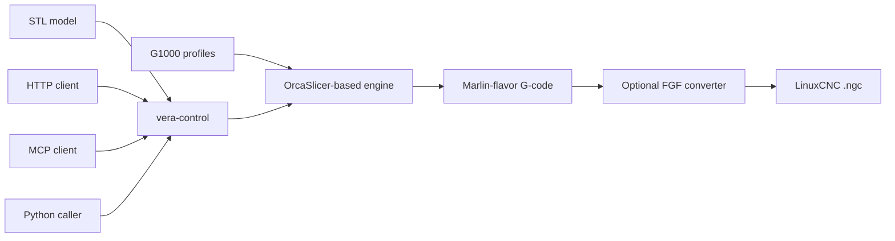

# VORMETRA Slice

**An OrcaSlicer-based pellet/FGF slicing workspace with a G1000 machine profile and a tested Python control layer.**

VORMETRA Slice makes the software assumptions behind a large-format pellet extrusion workflow inspectable. The repository contains the upstream-derived C++ engine, VORMETRA G1000 profiles, and `vera-control` interfaces for HTTP, MCP, and direct Python use.

**Status:** active development; source evaluation is available today. Portable control tests, an optional real OrcaSlicer CLI path, and an optional LinuxCNC converter path are kept as separate evidence layers. Physical G1000 commissioning and production qualification are not claimed.

[Open-source portfolio](https://www.mehmeterendereli.com/en/open-source) · [Control-layer guide](vera-control/README.md) · [Profile provenance](resources/profiles/VORMETRA/README.md) · [Upstream OrcaSlicer credits](README.upstream.md)

## Verified surface

| Layer | Current evidence | Boundary |
|---|---|---|
| Portable Python | 29 tests pass without a slicer binary; 3 dependency-bound tests skip visibly | Does not compile or execute the C++ desktop app |
| Real slicer CLI | The current repository profile slices a 200 × 200 × 100 mm fixture through a locally available OrcaSlicer v2.4.2 binary | Uses an external binary; it is not a repository release asset |
| LinuxCNC conversion | The generated Marlin-flavor G-code passes the explicitly configured converter integration test | Converter is an optional external dependency |
| Physical machine | No commissioning, throughput, accuracy, surface-quality, or endurance result is asserted | Requires controlled physical testing |

The local verification on 2026-09-04 completed all 32 tests when both optional software dependencies were explicitly configured. Hosted CI intentionally exercises only the portable layer.

## Quick start

Python 3.10 or newer is required.

```bash
git clone https://github.com/mehmeterendereli/vormetra-slice.git
cd vormetra-slice/vera-control
python -m pip install -e ".[dev]"
python -m pytest -q
```

The portable command is non-destructive and does not require the C++ desktop application. Tests that need `VERA_SLICER_BIN` or `VERA_FGF_POST_PATH` report a skip when the dependency is not configured; a skip is not a pass for that evidence layer.

## Architecture



All programmatic interfaces use the same `vera_control.slicer_bridge` implementation. The HTTP server binds to loopback by default and rejects non-loopback hosts and cross-origin state-changing requests.

## Repository map

```text
resources/profiles/VORMETRA/   G1000 machine, process, and pellet profiles
vera-control/                  Python HTTP, MCP, and direct-import control layer
src/, deps/, cmake/            OrcaSlicer-derived C++ engine and build system
tests/                         Upstream C++ test tree and local testing notes
README.upstream.md             Preserved upstream overview and community credits
CONTRIBUTING.md                Contribution, evidence, and license boundaries
```

This remains a thin product fork: VORMETRA-specific work is kept identifiable instead of being mixed invisibly into upstream code.

## Optional real-engine verification

Configure runtime paths in the shell; the source contains no user-specific defaults.

```powershell
$env:VERA_SLICER_BIN = (Resolve-Path ".\build\src\Release\orca-slicer.exe")
$env:VERA_PROFILES_DIR = (Resolve-Path ".\resources\profiles")
$env:VERA_DATA_DIR = (Join-Path $env:TEMP "vera-control-data")
Set-Location .\vera-control
python -m pytest -q
```

An external converter test can be enabled separately with `VERA_FGF_POST_PATH`. Keep that integration read-only and point it only at a reviewed local file.

## Interfaces

From `vera-control/`:

```bash
python run_dev.py
python -m vera_control.mcp_server
```

`run_dev.py` serves the Vera Console and HTTP API at `127.0.0.1:8765`. Override the loopback port with `VERA_PORT`; do not expose the development server to an untrusted network. The MCP command uses stdio transport and exposes `list_filaments`, `get_machine_limits`, `validate_model`, and `slice_stl`.

See [vera-control/README.md](vera-control/README.md) for endpoint and direct-import examples.

## Profile discipline

The G1000 profile separates:

1. design-derived machine geometry and software limits;
2. reference-machine starting values that still require G1000 calibration;
3. unresolved values retained as `TBD` rather than invented measurements.

The 1000 × 1000 × 1000 mm envelope and 5.0 mm nozzle are configuration inputs, not proof that a physical machine achieved the full envelope or a particular production result. Full field provenance is documented in [the profile guide](resources/profiles/VORMETRA/README.md).

## Known limitations

- No signed installer or executable is distributed by this repository.
- The complete C++ desktop build is not part of the portable Python workflow.
- Material temperatures, retraction, flow, and multi-zone control require physical calibration.
- The optional converter currently represents one heater-control channel; independent validation of four physical zones remains outside this repository's software proof.
- A successful CI run cannot establish physical throughput, dimensional accuracy, surface quality, or long-duration reliability.

## Build and test scope

The upstream Windows toolchain uses Visual Studio 2022 with Desktop development with C++ and CMake. See [the preserved upstream README](README.upstream.md) for the full engine build instructions. Repository-specific Python verification is documented in [vera-control/README.md](vera-control/README.md), and C++ test conventions are summarized in [tests/TESTING.md](tests/TESTING.md).

## Licenses and attribution

- **C++ engine and VORMETRA profiles:** GNU Affero General Public License v3.0; see [LICENSE.txt](LICENSE.txt).
- **`vera-control`:** MIT License; see [vera-control/LICENSE](vera-control/LICENSE).

VORMETRA Slice is based on OrcaSlicer. Original project history, contributor credit, and community links are preserved in [README.upstream.md](README.upstream.md) and the Git history.

## Türkçe özet

VORMETRA Slice; OrcaSlicer tabanlı motoru, G1000 makine profilini ve HTTP, MCP veya Python üzerinden kullanılabilen `vera-control` katmanını bir araya getirir. Repo bugün yazılım profilini ve kontrol zincirini sınanabilir kılar; fiziksel makinenin devreye alındığını veya üretim performansının kalifiye edildiğini iddia etmez. Başlangıç için `vera-control` dizininde `python -m pip install -e ".[dev]"` ve `python -m pytest -q` komutlarını çalıştırın.
